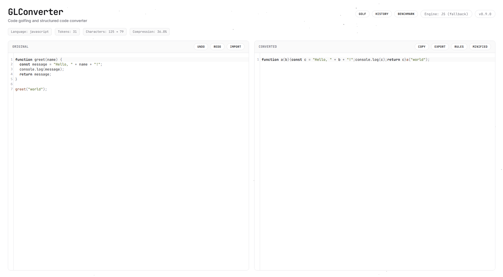

# GLConverter

Code golfing to structured code converter, and vice versa.

GLConverter converts source code between a fully structured, readable form
and a golfed form, with a minified or justified output mode. The original
code and the converted code are shown side by side, and edits are reflected
automatically between the two views.



## Status

Version `1.0.0` — first stable release. Structured-to-golfed and
golfed-to-structured conversion, a configurable golfing rules engine,
a Rust/WebAssembly engine with automatic JavaScript fallback and an
integrated benchmark, file import/export, session history with
undo/redo, a fully responsive white-theme interface, and a complete
automated test suite. See `CHANGELOG.md` for the full history.

### Keyboard shortcuts

| Shortcut | Action |
| --- | --- |
| `Alt+G` | Toggle Golf / De-golf |
| `Alt+M` | Toggle Minified / Justified |
| `Alt+C` | Copy the converted code |
| `Alt+E` | Open the Export menu |
| `Alt+H` | Open the History panel |
| `Alt+B` | Open the Benchmark panel |
| `Alt+R` | Open the Rules panel |
| `Alt+I` | Open the Import file picker |
| `Escape` | Close any open panel |

## Development

```bash
npm install
npm run dev
```

## Build

```bash
npm run build
```

The build first compiles the Rust engine to WebAssembly with
`wasm-pack` (`npm run build:wasm`), then runs the Vite production
build. If `wasm-pack` is not installed, the WASM step is skipped and
the application automatically falls back to the JavaScript engine.

The production build is output to `dist/` and is fully static, making it
directly deployable to GitHub Pages.

## Rust / WASM engine

The high-performance engine lives in `rust-engine/` and is compiled with
[`wasm-pack`](https://rustwasm.github.io/wasm-pack/):

```bash
cd rust-engine
cargo test
cd ..
npm run build:wasm
```

This produces `src/wasm/pkg/`, which is loaded dynamically at runtime
and is not committed to the repository; it is rebuilt on every install
and on every CI deployment.

## License

Copyright © 2026 Patrick JAILLET — All rights reserved.
See `LICENSE` for details.

Email: contact.shaderstudio@gmail.com
Website: https://patrickjaillet.github.io/sandefjord-software
